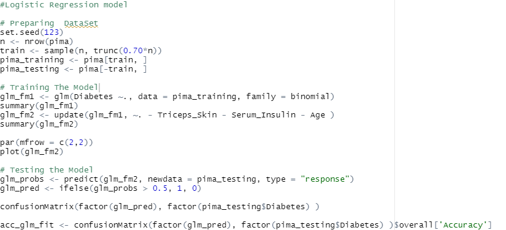
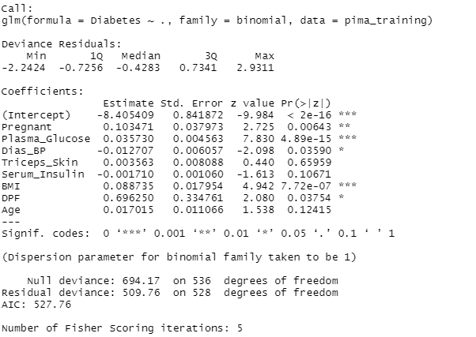
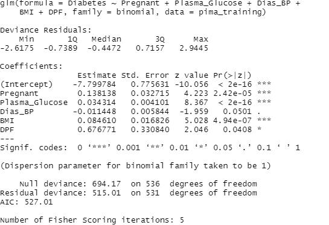
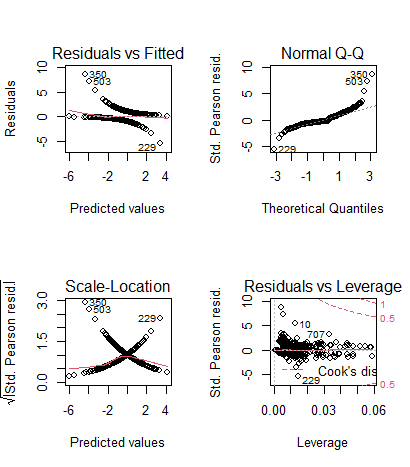
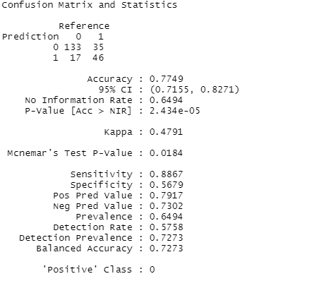
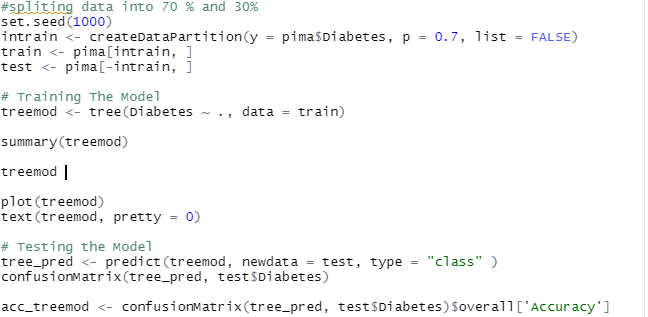
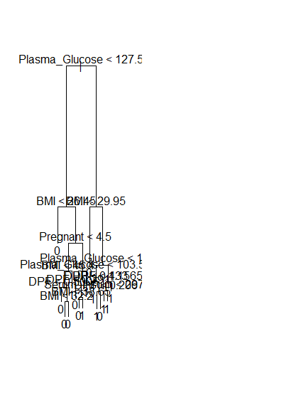
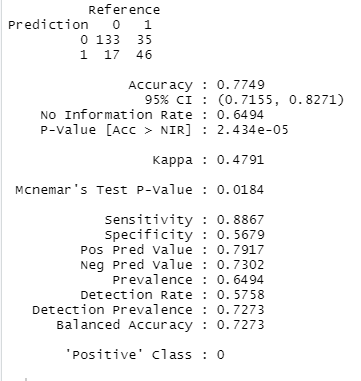

# ProjectROKGroup1

<!-- PROJECT LOGO -->
 

  

  <h3 align="center">Diabetes Prediction</h3>

<!-- TABLE OF CONTENTS -->

  
Table of Contents

  <ol>
    <li>
      <a href="#about-the-project">About The Project</a>
      <ul>
        <li><a href="#built-with">Built With</a></li>
      </ul>
    </li>
    <li>
      <a href="#contribution">Member and Contribution </a>
    </li>
    <li><a href="#Methods">Methods</a></li>
    <li><a href="#Roadmap">Roadmap</a></li>
     <li><a href="#Refrence">Refrence</a></li>
    <li><a href="#Important Note">Important Note</a></li>
  </ol>

<!-- ABOUT THE PROJECT -->
## About The Project

This dataset is originally from the National Institute of Diabetes and Digestive and Kidney Diseases. The objective of the dataset is to diagnostically predict whether or not a patient has diabetes, based on certain diagnostic measurements included in the dataset. Several constraints were placed on the selection of these instances from a larger database.
In particular, all patients here are females at least 21 years old of Pima Indian heritage. And this code will be displaying the result of prediction from diabetes.csv.
### Built With

This section should list any major frameworks that you built your project using. Leave any add-ons/plugins for the acknowledgements section. Here are a few examples.
* [Rstudio](https://www.rstudio.com/)

<!-- contribution -->
## contribution

1. CALVIN WONG = monitoring all member and helping them, Logistic Regression model part,shiny.
2. CHANDRA WINATA TJIA =  Decision Tree part
3. DANIEL CHEWNALDO = SVM part
4. ALEXANDRO MIKHA
5. CLAO PANSON

<!-- Methods -->
## Methods
1. Logistic Regression model
2. Decision Tree
3. SVM

<!-- Roadmap -->
## Roadmap

Logistic Regression model
 

 
In logistic regression model we create data partition or spliting the data into 70% and 30%.
pima_training is 70% and pima_testing is 30%,and we train the model glm_fm1 shown in the below  
 
 
 
if we look carefully at picture shown above we can see at the right side of Pr(> |z|) result there is star shown the more star the more it affect the result of prediction
so we select the Triceps_Skin,Serum_Insulin and Age to remove from model therefore there is glm_fm2 which shown below
 
 
 
here is the plot of model glm_fm2
 
 
 
shows error Residuals vs fitted values; . The dotted line at y=0 indicates our fit line; . Any point on fit line obviously has zero residual. Points above have positive residuals and points below have negative residuals. . The red line is the the smoothed high order polynomial curve to give us an idea of pattern of residual movement. In our case we can see that our residuals have logaritmic pattern that means we got a better model.
 
 
Normal Q-Q Plot: . The Normal Q-Q plot is used to check if our residuals follow Normal distribution or not; . The residuals are normally distributed if the points follow the dotted line closely; In this case residual points follow the dotted line closely except for observation #349 So our model residuals have passed the test of Normality.
 
 
Scale - Location Plot: . Scale location plot indicates spread of points across predicted values range; . One of the assumptions for Regression is Homoscedasticity . i.e variance should be reasonably equal across the predictor range; . A horizontal red line is ideal and would indicate that residuals have uniform variance across the range; . As residuals spread wider from each other the red spread line goes up; In our case the data is Homoscedastic i.e has uniform variance.
 
 
Residuals vs Leverage Plot: Before attacking the plot we must know what Influence and what leverage is. Lets understand them first. Influence : The Influence of an observation can be thought of in terms of how much the predicted scores would change if the observation is excluded. Cook’s Distance is a pretty good measure of influence of an observation. Leverage : The leverage of an observation is based on how much the observation’s value on the predictor variable differs from the mean of the predictor variable. The more the leverage of an observation , the greater potential that point has in terms of influence.
 
 
and last after the model tested we got the confusionmatrix which is shown below 
 
 

 
 
Decision Tree
 

 
In Decision Tree first thing we do is create data partition or spliting the data into 70% and 30%.
Train is 70% and test in 30%, the model is trained and the model name is treemod here is the plot of treemod
 

 
and last is the result of the confusionmatrix 
 

<!--Refrence -->
## Refrence
https://rpubs.com/rzezela77/346228

<!-- Important Note -->
## Important Note
to run shiny program create 2 seperate new Rscript and then copy ui.r from code above into new Rscript and then save as ui after that copy the server into new Rscript and save as server after that you can run the shiny program
 
 
the prediction class has nothing to do with shiny app if you run it. so prediction class need to run seperated from shiny class which show the result in console 

